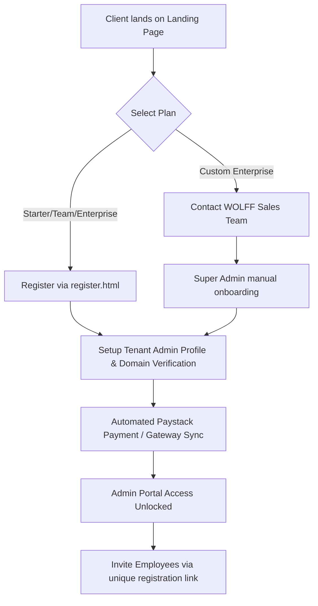

# Phase 2: Business Operations
## Operational Procedures & Management Workflows

This document outlines the operational procedures required for the daily management, support, billing, and lifecycle administration of the **MailFooter** application.

---

### 1. Organisational Roles & Responsibilities

To ensure operational continuity, the management and support of the MailFooter SaaS are split into the following functional areas:

* **Operations Management (COO / Product Owner)**: Oversees subscription metrics, billing compliance, Paystack ledger audits, client SLA agreements, and overall commercial growth.
* **Technical Maintenance (WOLFF Engineering Team)**: Responsible for code updates, Canary deployments, database integrity (SQLite compaction and backups), and infrastructure scaling on GoDaddy.
* **Customer Support (MailFooter Helpdesk)**: Handles incoming client tickets, template design adjustments, domain verification inquiries, and user access issues.
* **Sales & Account Management (WOLFF Sales)**: Negotiates custom plans, manages client onboarding assistance, and drives retention.

---

### 2. Client Onboarding Process
Onboarding is designed to be highly automated (self-service) with manual overrides for custom accounts.



#### Detailed Procedures
1. **Domain Registration**: The client registers at `register.html` using their corporate email. The domain name is extracted (e.g., `acme.com`) to serve as the tenant partition identifier in the database.
2. **Subscription Activation**:
   * **Self-Service**: The client selects their desired plan (Starter, Team, or Enterprise) and enters payment details via the integrated Paystack gateway. Once paid, the database creates a record in the `clients` table, generating a unique `remote_token`.
   * **Manual Onboarding (Sales-Assisted)**: For Custom Enterprise accounts, a WOLFF Super Admin uses the Super Admin command center (`super-admin.html`) to manually provision the account with custom user limits and ZAR/USD annual rates.
3. **Tenant Setup**: The tenant administrator receives access to `admin.html` to upload the corporate logo, set brand colors, configure social media URLs, upload promotional banners, and import employees.

---

### 3. Client Offboarding Process
Offboarding handles the graceful termination of client services and ensures database cleanliness.

* **Subscription Expiry**: If a client cancels their subscription or a recurring payment fails, Paystack sends a cancellation notification.
* **Grace Period**: The system provides a standard **14-day grace period** during which the account remains active, and warning banners appear in the client dashboard.
* **Suspension**:
   * If payment is not received by the end of the grace period, the account status is updated to `suspended`.
   * Outbound signatures continue rendering standard elements, but **marketing campaign banners are deactivated** (falling back to a clean blank spacer) to protect bandwidth, and tenant admins are locked out of `admin.html`.
* **Data Retention & Deletion**:
   * **Suspended Accounts**: Data is preserved in the database for **180 days** to allow easy reactivation.
   * **Permanent Offboarding**: If a client requests deletion, a WOLFF Super Admin uses the Super Admin Shell to purge the client's records from `clients`, `users`, `templates`, and `campaigns` tables.

---

### 4. Subscription Management & Billing
MailFooter utilises Paystack for automated payment capture, invoice ledger generation, and renewal warnings.

* **Automated Billing Flow**:
   * Paystack processes annual or monthly recurring payments.
   * Upon successful payment, a Paystack webhook triggers `api/super_admin.php?action=simulate_paystack_webhook`, updates the status to `active`, and logs the `paystack_reference` in the `invoices` table.
* **Manual Invoicing**:
   * For Enterprise clients paying via purchase orders, the WOLFF accounts department uses the Super Admin Dashboard to manually generate ZAR or USD invoices (`action=generate_invoice`).
   * When paid, the accounts department manually updates the status to `paid` to apply the activation.

---

### 5. Support Workflow & Escalation Process
Support requests follow a structured, multi-tier path to resolve issues efficiently.

```
[Staff Member / Employee]
         │
         ▼ (Internal Escalation)
[Tenant Admin (Client Manager)]
         │
         ▼ (Logs Ticket to support@mailfooter.co.za)
[Tier 1: MailFooter Helpdesk Support]
         │
         ▼ (Unresolved / Technical Bug)
[Tier 2: WOLFF Lead Systems Engineer]
         │
         ▼ (Critical Outage / Server Failure)
[Tier 3: COO / Technical Director]
```

#### Escalation SLA Parameters

| Support Tier | Scope of Issues | Target Resolution SLA | Operator |
| :--- | :--- | :--- | :--- |
| **Tier 1 (Helpdesk)** | Password resets, details corrections, signature copying help, basic HTML layout tweaks. | < 4 Hours | Customer Support Team |
| **Tier 2 (Systems)** | Rendering bugs in Outlook Desktop, database connection errors, tracking discrepancies, domain routing issues. | < 12 Hours | Lead Web Developer / Systems Engineer |
| **Tier 3 (Executive)** | Payment gateway failures, system-wide GoDaddy server downtime, data privacy issues, client suspension disputes. | < 2 Hours | Product COO / Tech Director |
