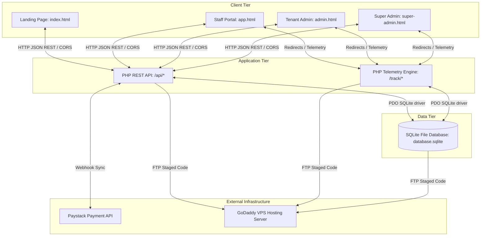
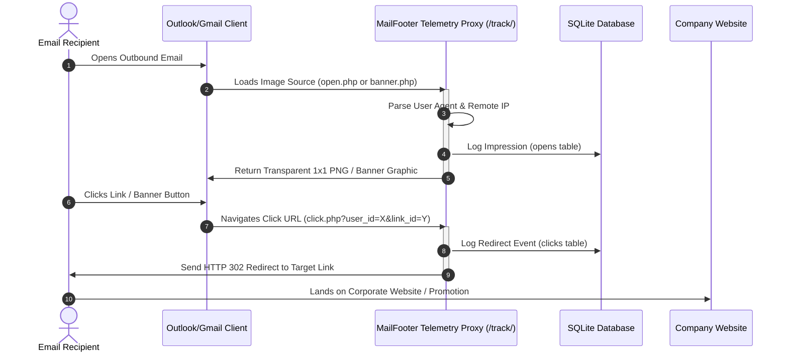

# Phase 5: System Architecture
## Technical System Topology & Codebase Architecture

This document provides a technical explanation of the MailFooter architecture, detailing the frontend frameworks, backend engines, databases, API routing layers, and infrastructure deployment pipelines.

---

### 1. High-Level System Topology
MailFooter is a multi-tenant web application utilizing a classic **client-server architecture**. It runs on a lightweight PHP backend, backed by an SQLite relational database, served dynamically to browser-based HTML/CSS/JavaScript frontends.

---

### 2. Frontend Technology Stack
The frontend is built entirely using **vanilla web technologies** to ensure maximum rendering speed, zero bundler dependencies, and complete developer flexibility.

* **HTML5**: Uses clean, semantic HTML5 structure with custom accessibility IDs for automated testing.
* **Vanilla CSS3**: Tailored styling using a dark-mode theme with modern CSS custom variables, ambient radial glow backdrops, and glassmorphism layouts. It does not use heavy frameworks (like Bootstrap or Tailwind) to keep asset load sizes under 100KB.
* **Vanilla JavaScript (ES6+)**: Handles front-end state management, form validation, dynamic previews, and interactive DOM manipulation (drag-and-drop file upload zones, snap-sliders, accordion FAQs).
* **Data Visualisation**: Uses **Chart.js** via CDN in dashboards for rendering real-time performance analytics.

---

### 3. Backend Technology Stack & API Directory
The backend is powered by **PHP 7.4+ / 8.x** running under Apache with a lightweight SQLite database module.

#### API Endpoint Directory (`/api/`)
* **[`db.php`](file:///c:/Users/Lennon%20Arends/Desktop/AntiGravity%20Apps/HTML%20Email%20Signatures/api/db.php)**: Prepares the SQLite file database (`database/database.sqlite`), initializes relational schemas, executes database structural migrations, and seeds default records.
* **[`users.php`](file:///c:/Users/Lennon%20Arends/Desktop/AntiGravity%20Apps/HTML%20Email%20Signatures/api/users.php)**: Processes staff member lookups, directory details saving, and signature deletion requests.
* **[`settings.php`](file:///c:/Users/Lennon%20Arends/Desktop/AntiGravity%20Apps/HTML%20Email%20Signatures/api/settings.php)**: Manages company brand colors, slogans, and logo URL configurations.
* **[`campaigns.php`](file:///c:/Users/Lennon%20Arends/Desktop/AntiGravity%20Apps/HTML%20Email%20Signatures/api/campaigns.php)**: Creates, edits, deletes, and lists active marketing campaign banners.
* **[`stats.php`](file:///c:/Users/Lennon%20Arends/Desktop/AntiGravity%20Apps/HTML%20Email%20Signatures/api/stats.php)**: Calculates impressions, clicks, click-through rates (CTR), and parses user agents for client/device reporting.
* **[`super_admin.php`](file:///c:/Users/Lennon%20Arends/Desktop/AntiGravity%20Apps/HTML%20Email%20Signatures/api/super_admin.php)**: Performs billing simulations, stages Canary rollouts, downloads database backups, and executes SaaS command terminal shell scripts.

---

### 4. Database Platform
* **Database Engine**: **SQLite 3**
* **Database File**: `database/database.sqlite` (Protected from public access via custom directory `.htaccess` instructions blocking file downloads).
* **Driver**: PHP Data Objects (PDO) SQLite wrapper.
* **Integrity Control**: Enforced foreign key checks (`PRAGMA foreign_keys = ON;`).

---

### 5. Authentication & Partitioning Mechanisms
* **Domain-Based Multi-Tenancy**: The application uses the employee's email domain (e.g., `@osholdings.co.za`) to partition records. When a user logs in, the backend performs a query:
  `SELECT * FROM clients WHERE domain = :domain`
  This verifies that their company is registered and restricts the templates and banners they can access.
* **Admin Authentication**: Validated against their registered email and encrypted password credentials. Authorized requests utilize `remote_token` keys passed in the request header (`X-Client-Impersonate`) to verify API actions.

---

### 6. Outbound Telemetry Tracking Engine (`/track/`)
A core component of MailFooter is its outbound email tracking engine, designed to bypass aggressive email spam filters and browser cookie locks.

#### Telemetry Files:
1. **[`logo.php`](file:///c:/Users/Lennon%20Arends/Desktop/AntiGravity%20Apps/HTML%20Email%20Signatures/track/logo.php)** & **[`open.php`](file:///c:/Users/Lennon%20Arends/Desktop/AntiGravity%20Apps/HTML%20Email%20Signatures/track/open.php)**: Embedded inside signatures as `` sources. Logs email open impressions, and returns a transparent `1x1` pixel PNG image.
2. **[`banner.php`](file:///c:/Users/Lennon%20Arends/Desktop/AntiGravity%20Apps/HTML%20Email%20Signatures/track/banner.php)**: Serves the active campaign graphic and logs impressions simultaneously.
3. **[`click.php`](file:///c:/Users/Lennon%20Arends/Desktop/AntiGravity%20Apps/HTML%20Email%20Signatures/track/click.php)**: Processes clicks on signature hyperlinks. Logs the click event, resolves the redirect target from the database (protecting target links from spam filter warnings), and performs an **HTTP 302 Found Redirect** to the destination page.

---

### 7. Hosting & Deployment Pipeline
* **Production Hosting**: GoDaddy Shared Hosting (migrating to GoDaddy VPS Server).
* **FTP Upload Script (`deploy.py`)**: Automates uploading files via Python FTP modules.
  * *Security Protection*: The deployment script is hardcoded to skip `.sqlite` database files to prevent developers from overwriting production database states during hotfixes.
